# Blockchain How to Run

## Install Dependencies

Run this once before starting the nodes:

```powershell
pip install flask cryptography
```

What they do:

- `profile`: shows node name, public key, and balance
- `chain`: shows the blockchain
- `mempool`: shows pending transactions
- `mine`: mines pending transactions and gives the miner reward
- `sync`: pulls the longest valid chain from registered nodes
- `register`: registers another node
- `send`: sends coins to another node using the receiver's public key

## Full Test Flow

### 1. Start 3 Nodes

Open 3 separate terminals and keep them running:

```powershell
python node.py -n Node1 -p 5000
```

```powershell
python node.py -n Node2 -p 5001
```

```powershell
python node.py -n Node3 -p 5002
```

### 2. Check Node Profiles

Run:

```powershell
python cli.py profile -p 5000
python cli.py profile -p 5001
python cli.py profile -p 5002
```

Note:

- the private key is managed inside the node and is not printed for safety

### 3. Register All Nodes

Run these in another terminal:

```powershell
python cli.py register -p 5000 --node http://127.0.0.1:5001
python cli.py register -p 5000 --node http://127.0.0.1:5002
python cli.py register -p 5001 --node http://127.0.0.1:5000
python cli.py register -p 5001 --node http://127.0.0.1:5002 
python cli.py register -p 5002 --node http://127.0.0.1:5000
python cli.py register -p 5002 --node http://127.0.0.1:5001
```

### 4. Get Node2 Public Key

Run:

```powershell
python cli.py profile -p 5001
```

Copy the full `public_key` from the output, including:

```text
-----BEGIN PUBLIC KEY-----
...
-----END PUBLIC KEY-----
```

### 5. Send From Node1 to Node2

Replace the placeholder below with Node2's public key:

```powershell
python cli.py send -p 5000 --amount 1 --receiver "-----BEGIN PUBLIC KEY-----\n...PASTE_NODE2_KEY...\n-----END PUBLIC KEY-----\n"
```

### 6. Check Mempool on Another Node

Run:

```powershell
python cli.py mempool -p 5002
```

### 7. Mine the Block on Node3

Run:

```powershell
python cli.py mine -p 5002
```

### 8. Sync the Other Nodes

Run:

```powershell
python cli.py sync -p 5000
python cli.py sync -p 5001
```

### 9. Verify Final Balances

Run:

```powershell
python cli.py profile -p 5000
python cli.py profile -p 5001
python cli.py profile -p 5002
```

### 10. Inspect the Final Chain

Run:

```powershell
python cli.py chain -p 5000
```

# Documentation

## 1. Creating each node profile/wallet

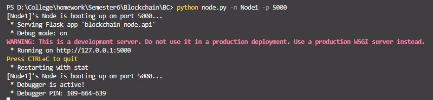

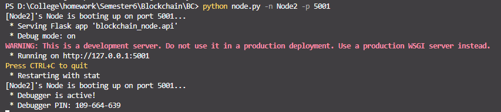

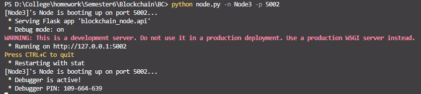

## 2. Node 1, 2, 3 Profile

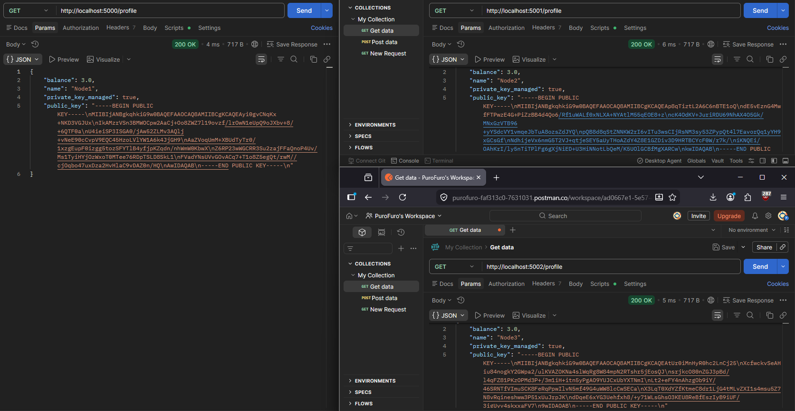

## 3. Node 1 before registering

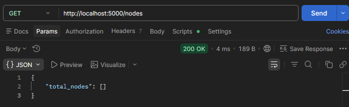

## 4. Node 1 after registering

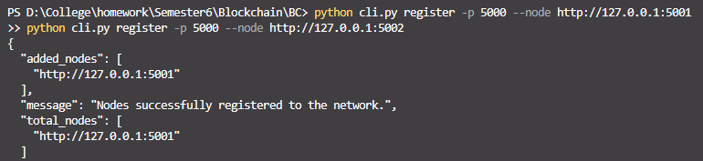

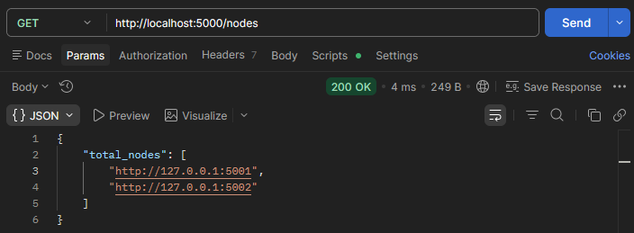

## 5. Registering Node 1, 2

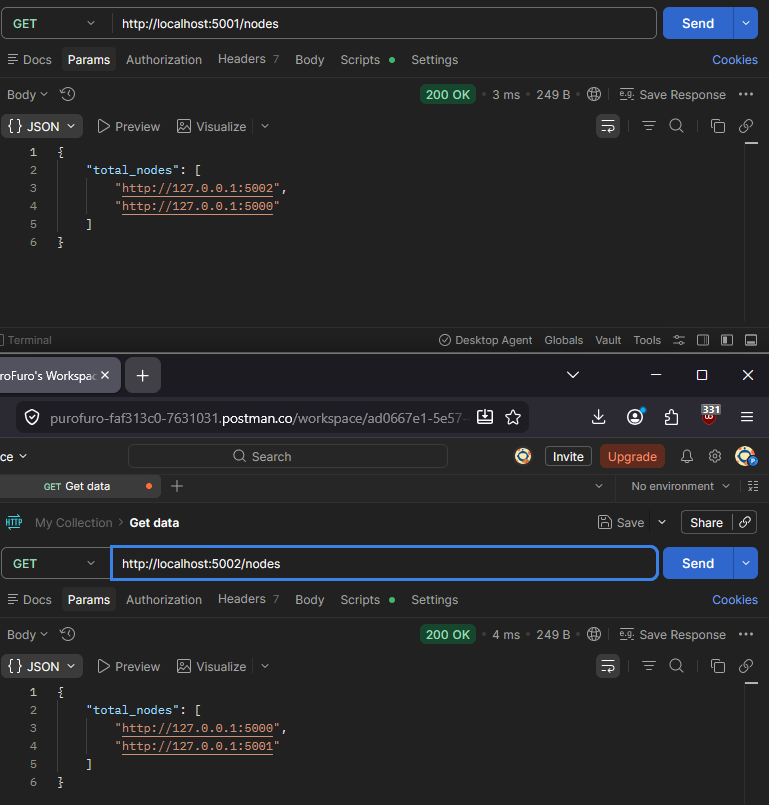

## 6. Transaction from Node 1 (Port 5000) to Node 2 (Port 5001)

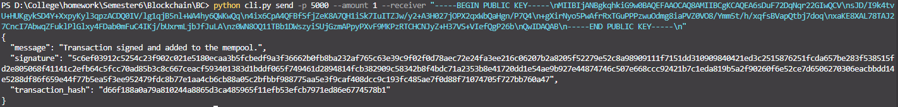

## 7. Checking the mempool from Node 3

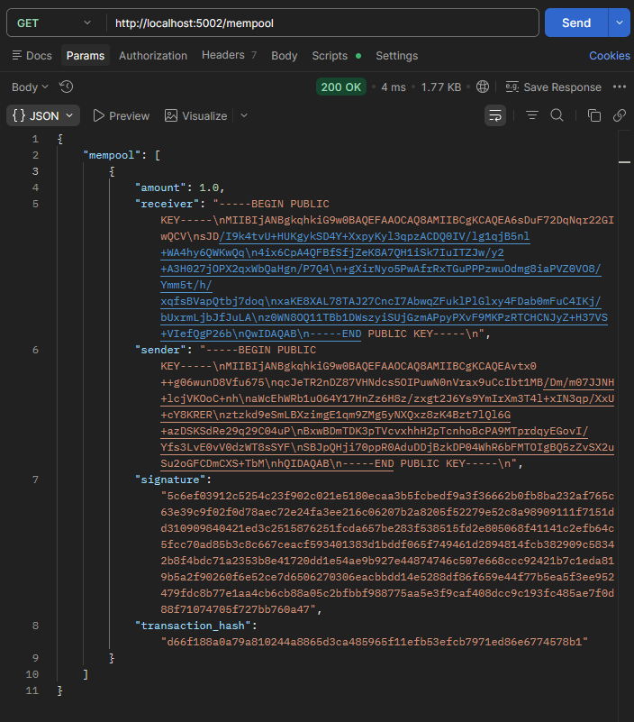

## 8. Node 3 mines the block

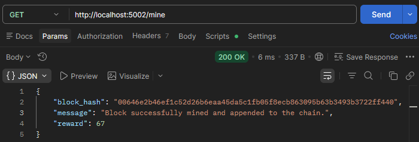

## 9. Node 3's chain after mining

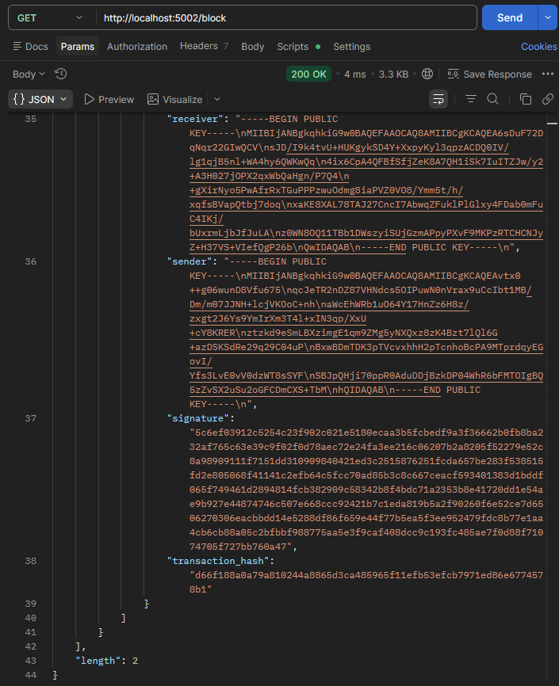

## 10. Node 1's chain before syncing

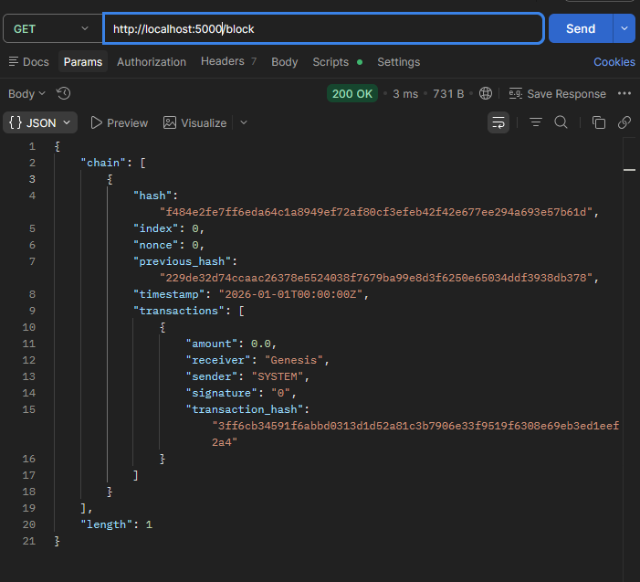

## 11. Syncing both for Node 1 and 2

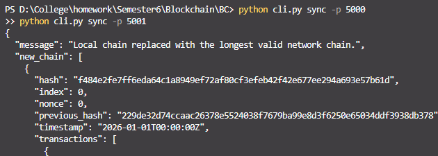

## 12. Node 1's chain after syncing

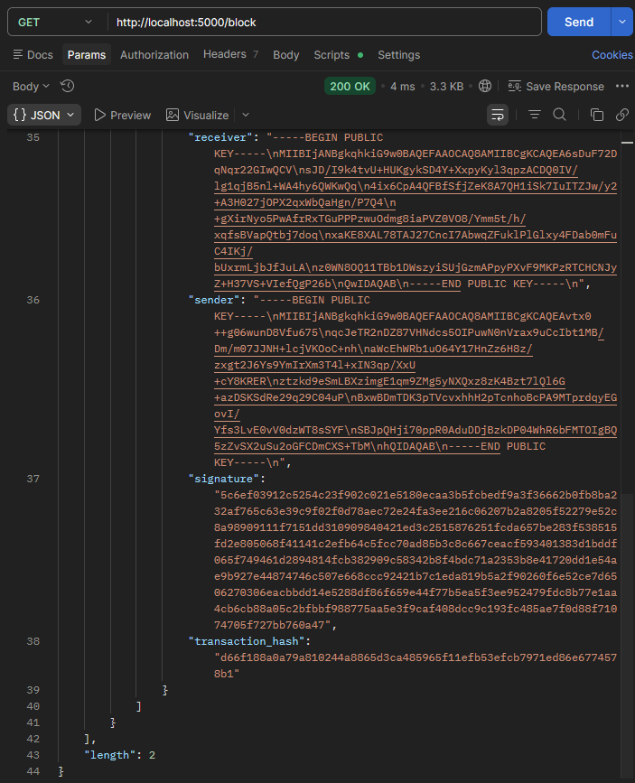

## 13. All Node's profile and the balance

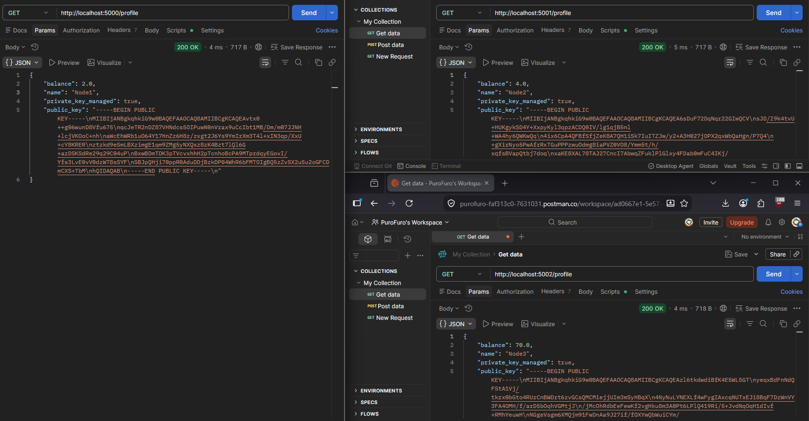

## 14. `fake_test.py` for testing validity (Validating using private key)

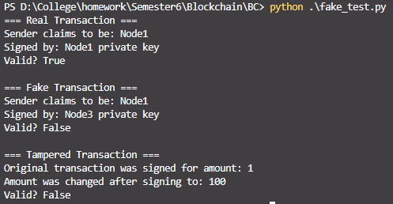